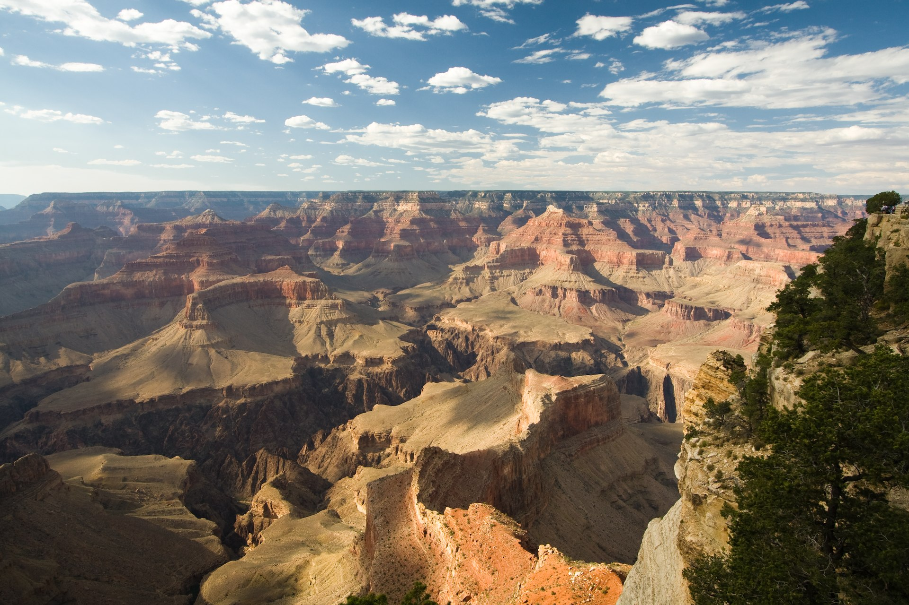

# Last-Minute Late-October Backpacking in the US

A mobile-first, filterable guide to **30 late-October backpacking trips** across the US,
sorted by how easily you can book them right now — with real photos, an overview map,
plan-it summaries, and quick links (Maps, Recreation.gov, AllTrails, weather).

**Live site:** https://diosmiodio.github.io/late-october-backpacking/



## Why late October

When the high country (Sierra, Rockies, Cascades, northern Appalachians) is already
getting snow and hard freezes, the sweet spot shifts to the desert Southwest, southern
California, mild coastlines, and the southern/Appalachian foliage belt. Trips are tagged
by **bookability** so you can find something you can actually grab on short notice:

- 🟢 **Open access** — no reservation; self-register at the trailhead.
- 🔵 **Easy now** — reservable right now; rarely sells out for late October.
- 🟠 **Competitive** — bookable but contested; apply early, keep backup dates.

## How it's built

A dependency-free static site. A small Node build step turns the dataset into
pre-rendered HTML (so content and official links work even without JavaScript);
vanilla JS adds filtering/search/sort, a deep-linkable detail view, and a Leaflet map.

```
data/source.json            Original dataset (unmodified)
data/destinations.json      Generated, enriched dataset
assets/images/              Downloaded photos + credits.json (attribution)
scripts/fetch-images.mjs    Sources free-licensed photos from Wikimedia Commons
scripts/enrich.mjs          Adds coordinates, links, and plan-it summaries
scripts/build.mjs           Renders dist/
src/template.mjs            HTML generation
src/styles.css              Styles (mobile-first)
src/app.js                  Filtering, detail modal, map
```

### Develop

```bash
npm run build      # enrich + build into dist/
npm run serve      # serve dist/ locally
```

To re-source photos (only needed if changing the image set):

```bash
npm run fetch-images          # fetch any missing
npm run fetch-images -- --force   # re-fetch all
```

Deployment is automatic: pushing to `main` runs `.github/workflows/deploy.yml`,
which builds `dist/` and publishes it to GitHub Pages.

## Data & accuracy

> **Informational only.** Permit rules, quotas, and seasonal/fire closures change
> constantly. Always confirm on each destination's official site before committing.
> Coordinates are **approximate** (trailhead/area), used for the map and links.

The "plan-it" water and risk notes are derived from each destination's own pros/cons —
re-surfaced for scannability, not independently verified trail beta.

## Photo credits

Every photo is a freely-licensed image (CC BY / CC BY-SA / CC0 / Public Domain) from
**Wikimedia Commons**, downloaded locally. Per-photo author, license, and source links
are recorded in [`assets/images/credits.json`](assets/images/credits.json) and shown in
the site footer and on each destination's detail view. Map tiles © OpenStreetMap
contributors, © CARTO.

## License

Code is MIT (see `package.json`). Photographs remain under their respective licenses as
credited; the underlying destination dataset is provided as-is for informational use.
