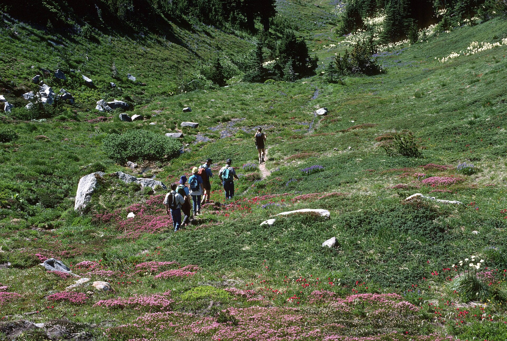

# Last-Minute Late-October Backpacking in Oregon

A mobile-first, filterable guide to **7 late-October backpacking trips in Oregon**,
sorted by how easily you can book them right now — with real photos, an overview map,
plan-it summaries, and quick links (Maps, Recreation.gov, AllTrails, weather).

**Live site:** https://diosmiodio.github.io/late-october-backpacking/



## Why late October

By late October the high Oregon Cascades and the Wallowas are catching their first snows,
so the sweet spot splits two ways: lower, drier trips that shrug off the shoulder season
(the Rogue River canyon, the Strawberry Range, forgiving Sky Lakes) and the marquee alpine
basins (Jefferson Park, the Wallowas Lakes Basin, Green Lakes) that are stunning but a
genuine first-snow gamble this late. Trips are tagged by **bookability** so you can find
something you can actually grab on short notice:

- 🟢 **Open access** — no reservation; self-register at the trailhead.
- 🔵 **Easy now** — reservable right now; rarely sells out for late October.
- 🟠 **Competitive** — bookable but contested; apply early, keep backup dates.

## How it's built

A dependency-free static site. A small Node build step turns one JSON file into
pre-rendered HTML (so content and official links work even without JavaScript);
vanilla JS adds filtering/search/sort, a deep-linkable detail view, and a Leaflet map.

```
data/destinations.json      The dataset — every trip plus its coordinates,
                            water/risk notes, and photo credit (one file)
assets/images/              Downloaded photos (one <id>.jpg per trip)
scripts/fetch-images.mjs    Sources free-licensed photos from Wikimedia Commons
scripts/build.mjs           Renders dist/
src/derive.mjs              Computes each trip's links + plan-it summary at build time
src/template.mjs            HTML generation
src/styles.css              Styles (mobile-first)
src/app.js                  Filtering, detail modal, map
```

### Develop

```bash
npm run build      # build dist/ from data/destinations.json
npm run serve      # serve dist/ locally
```

### Adding or editing a trip

Everything lives in **`data/destinations.json`**. To **edit** a trip (its text,
coordinates, water/risk notes, bookability…) or **remove** one, change that file and
rebuild — each trip's `links` and plan-it summary are recomputed automatically.

To **add** a trip, copy an existing entry, edit its fields, and give it a photo —
either drop `assets/images/<id>.jpg` in place and fill the entry's `image` block, or
add an `image_query` and run `npm run fetch-images <id>` to source a freely-licensed
one from Wikimedia Commons (it downloads the photo and writes the attribution back
into the JSON for you).

```bash
npm run fetch-images              # fetch photos for any trips still missing one
npm run fetch-images -- --force   # re-fetch every photo
```

Deployment is automatic: pushing to `main` runs `.github/workflows/deploy.yml`,
which builds `dist/` and publishes it to GitHub Pages.

## Data & accuracy

> **Informational only.** Permit rules, quotas, and seasonal/fire closures change
> constantly. Always confirm on each destination's official site before committing.
> Coordinates are **approximate** (trailhead/area), used for the map and links.

The "plan-it" water and risk notes are derived from each destination's own pros/cons —
re-surfaced for scannability, not independently verified trail beta.

## Photo credits

Every photo is a freely-licensed image (CC BY / CC BY-SA / CC0 / Public Domain) from
**Wikimedia Commons**, downloaded locally. Per-photo author, license, and source links
are recorded inline in [`data/destinations.json`](data/destinations.json) (each trip's
`image` field) and shown in the site footer and on each destination's detail view.
Map tiles © OpenStreetMap contributors, © CARTO.

## License

Code is MIT (see `package.json`). Photographs remain under their respective licenses as
credited; the underlying destination dataset is provided as-is for informational use.
